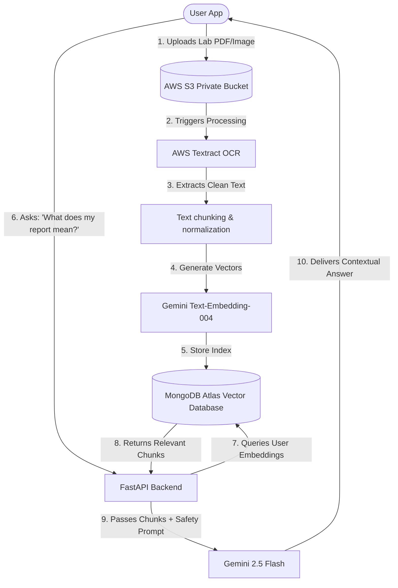
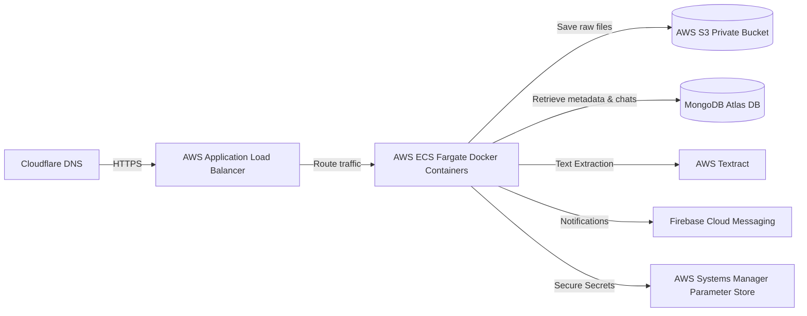

# Blumetara AI — Premium Proposal & Architecture Deck

This interactive deck outlines the complete product architecture, commercial model, and delivery plan. Click through the slides below to review.

````carousel
# Slide 1: Welcome to Blumetara AI
### *Your AI-Powered Healthcare Co-Pilot*

---

> [!NOTE]
> **Product Mission**: To democratize personal health management by combining existing Large Language Models (LLMs), secure AWS Textract OCR, Retrieval-Augmented Generation (RAG), and smart notifications into a single, intuitive wellness assistant.

#### **Key Focus Areas for the MVP:**
* **TARA AI Agent**: Conversational health coach grounded in your health files.
* **AWS Ingestion**: Seamless extraction and categorization of lab reports.
* **Proactive Reminders**: Time-based schedules for medicine adherence and hydration.
* **Workout Generator**: Personalized plans based on demographic and goal filters.

<!-- slide -->
# Slide 2: The Core User Flow
### *RAG (Retrieval-Augmented Generation) & OCR Pipeline*



<!-- slide -->
# Slide 3: Free vs. Paid Tier Matrix
### *Ensuring High Conversion & Subscription-Readiness*

| Feature Area | Free Tier (Ad-Supported) | Paid Tier (Ad-Free Premium) |
| :--- | :--- | :--- |
| **TARA Chat limit** | 5 messages / day | 20 messages / day |
| **Medicine Tracker** | 1 active schedule | Unlimited schedules + Stock tracking |
| **Water Reminders** | 2 alerts / day | Custom frequencies & smart intervals |
| **Goal Tracker** | 1 active goal | Up to 5 active goals |
| **Lab Reports** | Single upload, simple summaries | Unlimited uploads, trend gap analysis |
| **Workouts** | General static plans | AI-Generated plans (updates weekly) |
| **Support** | Standard Email support | Priority Call-back support |

> [!TIP]
> This model keeps processing and LLM inference costs predictable while driving users toward the premium tier for custom scheduling and deep health insights.

<!-- slide -->
# Slide 4: Premium App UI Design Preview
### *High-fidelity design components and dark-mode styling tokens*

```css
/* Custom CSS Design Tokens for Blumetara AI */
:root {
  --primary-green-dark: #1E392A;
  --accent-mint: #4EAD73;
  --slate-black: #0B0E0C;
  --bg-gradient: linear-gradient(135deg, #0B0E0C 0%, #152219 100%);
  --card-glass: rgba(30, 57, 42, 0.2);
  --border-glass: rgba(78, 173, 115, 0.15);
  --text-white: #F4F6F4;
}
```

* **Modern Glassmorphic Cards** with subtle borders mapping active goals.
* **Interactive Chat Interface** featuring inline tags showing exactly *which* uploaded report TARA is pulling context from.
* **Circular Progress Goal Indicators** highlighting hydration and steps.
* **"Coming Soon" Food Tracking teaser card** showing a clean blurred effect with a lock icon to stimulate user interest.

<!-- slide -->
# Slide 5: Production Architecture on AWS
### *Secure, Scalable, and Extensible*



#### **AWS Security Safeguards:**
* **IAM Least Privilege**: ECS tasks hold permissions only for specific S3 folders and AWS Textract APIs.
* **Secure Document Sharing**: Frontend reads lab reports using temporary S3 Presigned URLs (expiry: 15 mins).
* **Environment Isolation**: Production, Staging, and Development variables kept completely separate.

<!-- slide -->
# Slide 6: Budget Classification & Timeline
### *Development Cost Breakdown & Launch Strategy*

| Project Phase | Focus & Deliverables | Timeline | Cost (INR) |
| :--- | :--- | :--- | :--- |
| **Phase 1: Planning** | Scope confirmation, UI Wireframes, AWS Architecture | Week 1 | *Initiation* |
| **Phase 2: MVP Development** | FastAPI monolith, AWS S3/Textract setup, RAG chatbot, Core Flutter App | Weeks 2-6 | **INR 2,20,000** |
| **Phase 3: Version 1** | Reminders, Goal indicators, daily/weekly summaries, workout modules | Weeks 7-9 | **INR 1,60,000** |
| **Phase 4: Version 2 & Admin** | React/Next.js Admin Panel, subscription modules, AWS deployment | Weeks 10-12 | **INR 2,00,000** |
| **Total Scope** | **Play Store Ingestion Ready Product** | **12 Weeks** | **INR 5,80,000** |

> [!IMPORTANT]
> **Third-Party Costs Excluded**: Client pays AWS resource hosting, MongoDB Atlas, Firebase SMS/Auth scale, Google Play Developer console fee, and Gemini API credits.

<!-- slide -->
# Slide 7: Play Store Launch Checklist
### *Our step-by-step roadmap to publishing*

1. **Google Play Console Account Setup**:
   * Setup account ($25 one-time fee paid directly to Google).
   * Create Google Merchant Account to accept subscription payments.
2. **Firebase Credential Mapping**:
   * Inject `google-services.json` inside `android/app/`.
   * Configure FCM credentials inside the Firebase console.
3. **Medical Guidelines Policy Review**:
   * Complete Google Play Console's "Financial & Medical App Declarations".
   * Add prominent disclaimer in App Store description and inside the app drawer:
     * *"Blumetara AI provides lifestyle guidance. Consult a medical practitioner before changes."*
4. **Internal Closed Testing**:
   * Deploy to Play Store Closed Testing track (requires 20 testers for 14 days minimum).
   * Monitor performance, crash rates (via Sentry/Crashlytics), and prompt accuracy.
5. **Production Release**:
   * Push version 1.0.0 to public track.
````
